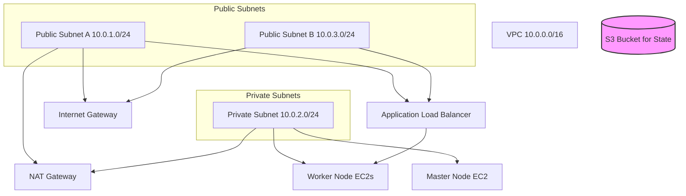

# 🚀 Kubernetes Cluster on AWS EC2 with Terraform

This repository provisions a **manual Kubernetes cluster** on AWS EC2 using Terraform.  
It is split into two parts:
- **`terraform-state-backend/`** → creates the S3 bucket for storing Terraform state
- **`terraform-k8s-setup/`** → provisions VPC, subnets, EC2 master/worker nodes, IAM roles, security groups, and an Application Load Balancer

---

## 📂 Repository Structure
```
k8s-cluster/
|-- README.md
|-- terraform-k8s-setup				# Cluster infra + EC2 nodes
|   |-- backend.tf
|   |-- ec2.tf
|   |-- endpoints.tf
|   |-- iam.tf
|   |-- lb.tf
|   |-- main.tf
|   |-- network.tf
|   |-- outputs.tf
|   |-- outputs.txt
|   |-- scripts
|   |   |-- master-init.sh
|   |   `-- worker-init.sh
|   |-- sg.tf
|   |-- variables.tf
|   `-- vpc.tf
`-- terraform-state-backend			# S3 bucket + backend config
    |-- backend.tf
    |-- main.tf
    |-- remote-state.tf
    |-- terraform.tfstate
    |-- terraform.tfstate.backup
    `-- variables.tf
```

---

## ⚙️ Features
- **Networking**
  - VPC (`10.0.0.0/16`)
  - 2 public subnets (`10.0.1.0/24`, `10.0.3.0/24`)
  - 1 private subnet (`10.0.2.0/24`)
  - Internet Gateway + NAT Gateway
  - Route tables for public/private traffic
- **Compute**
  - Master node (Ubuntu 22.04, `t3.medium`)
  - Worker nodes (Ubuntu 22.04, `t3.medium`, count configurable)
  - Root volume: 30 GB, `gp3`
- **IAM + Endpoints**
  - IAM role/profile with `AmazonSSMManagedInstanceCore`
  - VPC endpoints for SSM, EC2 messages
- **Load Balancer**
  - Application Load Balancer (public)
  - Target group forwarding to worker NodePort `30080`
  - Health check on `/healthz`
- **Bootstrap Scripts**
  - `master-init.sh` → kubeadm init, Calico CNI, kubeconfig setup
  - `worker-init.sh` → kubeadm prerequisites, ready for manual join
- **Remote State**
  - S3 bucket with versioning + AES256 encryption
  - Backend configured in both folders

---

## 🛠️ Prerequisites
- Terraform >= 1.5
- AWS CLI configured (`terraform_user` profile)
- IAM permissions to create VPC, EC2, S3, IAM roles, LB

---

## 🚀 Usage

### 1. Provision State Backend
Since the backend itself is created here, the first run must be local:
```bash
cd terraform-state-backend
terraform init -backend=false
terraform apply
```
Then migrate state to S3:
```bash
terraform init -reconfigure
```

### 2. Provision Cluster Infra
```bash
cd ../terraform-k8s-setup
terraform init
terraform apply
```
### 3. Master Node Initialization
- The master-init.sh script runs automatically via EC2 userdata.

- It disables swap, installs containerd + Kubernetes v1.34, runs kubeadm init --pod-network-cidr=10.244.0.0/16, configures kubectl, and applies Calico CNI.

- No manual SSH is required.

### 4. Worker Node Setup
- The worker-init.sh script also runs automatically via EC2 userdata.

- Each worker is prepped with containerd + kubeadm prerequisites.

- To join workers, retrieve the kubeadm join command from the master node and run it manually inside each worker session.

### 5. Accessing Nodes
- Login via AWS SSM Session Manager (no SSH ports or keys required).
- Example:
```bash
aws ssm start-session --target <instance-id> --region ap-south-1
```
- This works because IAM role + VPC endpoints for SSM/EC2 messages are provisioned automatically.

---

## 📤 Outputs
After terraform apply, you’ll get:

* Master EC2 instance ID + tags

* Worker EC2 instance IDs + tags

* SSM status for all nodes

* ALB DNS name (via AWS console)

---

## 📝 Notes
- Worker join is manual

- Pod CIDR: 10.244.0.0/16 (Calico default).

- ALB forwards traffic on port 80 → worker NodePort 30080.

- SSM only: All node access is via AWS Systems Manager Session Manager.

- Automation: Master and worker init scripts are applied automatically at instance creation.

- Manual step: Worker nodes still require a manual kubeadm join command to connect to the cluster.

- Security groups allow:

	- Control plane access (API server, SSH)

	- Worker node traffic

	- ALB HTTP ingress

---

## 📊 Architecture Diagram (Mermaid)


---


